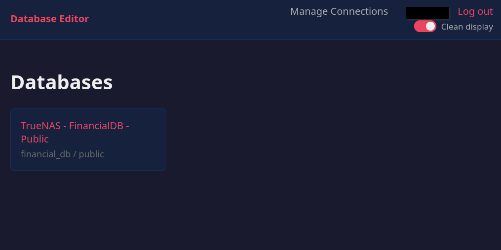
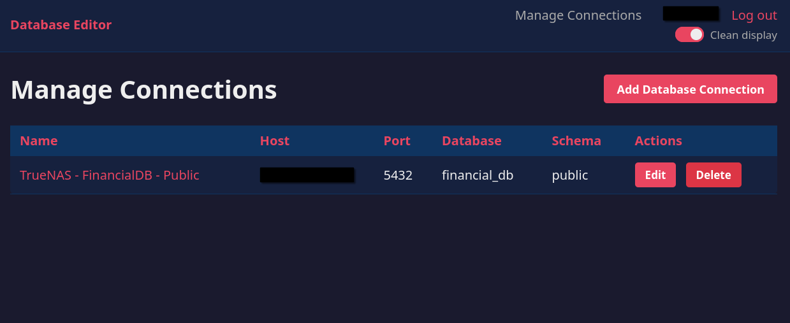

# Local Database Editor

Django web app for PostgreSQL databases: runtime schema introspection, sortable/filterable data grid with inline row editing. Only modified rows are saved. Single-user authentication.

**Configuration via environment variables only** — copy `.env.example` to `.env` and set all values.

## Features

- Connect to PostgreSQL (config via `.env`)
- Browse schemas and tables (auto-detected at runtime)
- Sort and filter on all columns
- Inline row editing (save only modified rows)
- Docker Hub deployment or compressed image for air-gapped systems

**Note:** Only tables with primary keys are editable. Tables without primary keys are read-only.

## Prerequisites

- Docker and Docker Compose
- PostgreSQL reachable from host/container

## Quick Start

1. **Configure environment**:
   ```bash
   cp .env.example .env
   # Edit .env: set DJANGO_SECRET_KEY, DEBUG, ALLOWED_HOSTS, PG_*, EDITOR_*
   # For Docker Hub: set DOCKER_IMAGE=username/local-database-editor:latest
   ```

2. **Run**:
   ```bash
   docker compose pull
   docker compose up -d
   ```

3. **Access**: http://localhost:8088 (login with `EDITOR_USERNAME` / `EDITOR_PASSWORD`)

The `DOCKER_IMAGE` env var controls which image Compose uses. If unset, defaults to `local-database-editor:latest` (local builds).

## Publishing to Docker Hub

```bash
docker login
make push DOCKER_USER=your-username VERSION=1.0.1
```

Users set `DOCKER_IMAGE=your-username/local-database-editor:latest` in `.env`.

## Air-Gapped Deployment

1. Export image:
   ```bash
   docker save username/local-database-editor:latest | gzip > editor-image.tar.gz
   ```

2. Transfer and load:
   ```bash
   docker load < editor-image.tar.gz
   ```

3. Configure `.env` (leave `DOCKER_IMAGE` unset)

4. Run:
   ```bash
   docker compose up -d --no-build
   ```

## Remote Systems (TrueNAS, etc.)

Mount the **directory** containing the SQLite database (not just the file) for write access:

```yaml
services:
  web:
    image: username/local-database-editor:latest
    env_file:
      - /path/to/.env
    environment:
      - SQLITE_DB_PATH=/app/data/db.sqlite3
    volumes:
      - /mnt/data/apps/local-database-editor:/app/data
```

Ensure directory permissions:
```bash
chmod 755 /mnt/data/apps/local-database-editor
chown -R $USER:$USER /mnt/data/apps/local-database-editor
```

## Environment Variables

All variables are required (no defaults in code).

| Variable | Description |
|----------|-------------|
| `DJANGO_SECRET_KEY` | Django secret key |
| `DEBUG` | `0` or `1` |
| `ALLOWED_HOSTS` | Comma-separated hosts |
| `ALLOWED_HOSTS_IP_RANGES` | (Optional) Comma-separated CIDR ranges |
| `PG_ALIAS` | Django DB alias and UI label |
| `PG_HOST` | PostgreSQL host |
| `PG_PORT` | PostgreSQL port |
| `PG_DB` | Database name |
| `PG_USER` | PostgreSQL user |
| `PG_PASSWORD` | PostgreSQL password |
| `EDITOR_USERNAME` | Login username |
| `EDITOR_PASSWORD` | Login password |
| `EDITOR_EMAIL` | User email |
| `DOCKER_IMAGE` | (Optional) Docker image name |
| `SQLITE_DB_PATH` | (Optional) SQLite path (default: `/app/db.sqlite3`) |

## Development

```bash
python -m venv .venv
.venv/bin/pip install -r requirements.txt
cp .env.example .env
# Set all variables in .env
.venv/bin/python manage.py migrate
.venv/bin/python manage.py create_single_user --noinput
.venv/bin/python manage.py runserver
```

## Demo





## License

MIT License
